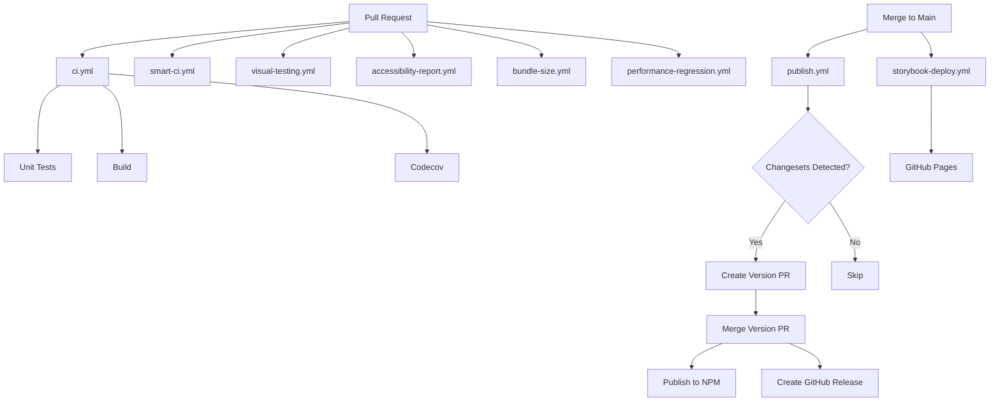

# CI/CD Workflows Documentation

Complete reference for all GitHub Actions workflows in the USWDS Web Components project.

## 📊 Workflow Overview

This project has **30 GitHub Actions workflows** organized into several categories:

- **Core CI/CD**: Main build, test, and deployment pipelines
- **Quality Assurance**: Linting, testing, accessibility, performance
- **Visual Testing**: Chromatic, Playwright visual regression
- **Publishing**: NPM publishing, release management
- **Automation**: Dependency updates, maintenance tasks

---

## 🔄 Core CI/CD Workflows

### `ci.yml` - Main CI Pipeline
**Trigger**: All PRs and pushes to main
**Purpose**: Core validation pipeline

**Jobs**:
1. **Linting** - ESLint + Prettier validation
2. **TypeScript** - Type checking with tsc
3. **Testing** - Unit tests with Vitest + coverage
4. **Build** - Production build + bundle size validation

**Features**:
- Turborepo caching for faster builds
- Codecov integration for coverage tracking
- Bundle size validation with PR comments
- Fails on any quality check failure

**Run Time**: ~5-8 minutes

---

### `smart-ci.yml` - Smart CI (Affected Packages Only)
**Trigger**: PRs and pushes to main/develop
**Purpose**: Optimized CI for monorepo - only tests changed packages

**Jobs**:
1. **Detect Changes** - Uses path filters to find affected packages
2. **Build Affected** - Builds only changed packages + dependents
3. **Test Affected** - Tests only changed packages (parallel)
4. **Lint Affected** - Lints only changed packages

**Features**:
- Turborepo caching with GitHub Actions cache
- Path-based change detection
- Skips CI if no package changes
- 3-5x faster than full CI for small changes

**Run Time**: ~2-4 minutes (affected only)

---

## 🎨 Visual Testing Workflows

### `visual-testing.yml` - Chromatic Visual Tests
**Trigger**: PRs to main
**Purpose**: Visual regression testing with Chromatic

**Features**:
- Automated visual diff detection
- Auto-accept changes on main branch
- Only changed stories testing
- Storybook deployment to Chromatic

**Configuration**: Uses `CHROMATIC_PROJECT_TOKEN` secret

---

### `visual-regression.yml` - Playwright Visual Tests
**Trigger**: Path-specific changes to components
**Purpose**: Backup visual regression testing

**Jobs**:
- **Visual Tests** - 334+ component snapshots with Playwright
- **Baseline Comparison** - Compares against stored baselines

**Run Time**: ~3-5 minutes

---

## 🧪 Quality Assurance Workflows

### `accessibility-report.yml` - Accessibility Reporting
**Trigger**: PRs to main, manual dispatch
**Purpose**: Comprehensive accessibility testing

**Features**:
- Tests all Storybook components with axe-core
- Generates HTML and JSON reports
- PR comments with violation summary
- Categorizes issues by severity (critical/serious/moderate/minor)
- Uploads reports as artifacts

**Reports**:
- `accessibility-report.html` - Interactive HTML report
- `accessibility-results.json` - Machine-readable results

**Run Time**: ~4-6 minutes

---

### `bundle-size.yml` - Bundle Size Monitor
**Trigger**: PRs to main
**Purpose**: Enforce performance budgets

**Budgets**:
- Main bundle: 250KB
- Category packages: 50KB each
- Warns at 90% utilization
- Fails CI on violations

**Features**:
- PR comments with bundle analysis
- Links to optimization guide
- Uploads bundle analysis artifacts

**Run Time**: ~3-4 minutes

---

### `performance-regression.yml` - Performance Benchmarking
**Trigger**: PRs and pushes to main
**Purpose**: Detect performance regressions

**Jobs**:
1. **Performance Benchmark** - Playwright-based performance tests
   - Bundle load time
   - Component render times
   - Memory usage monitoring
   - Bundle size tracking

2. **Lighthouse Audit** - Lighthouse CI performance scores
   - Performance: 80% minimum
   - Accessibility: 95% minimum (ERROR level)
   - Core Web Vitals budgets

3. **Performance Summary** - Aggregated report

**Features**:
- Baseline comparison (detects >10% regressions)
- Fails CI on significant regressions
- Updates baseline on main branch
- Detailed performance artifacts

**Run Time**: ~6-8 minutes

---

## 📦 Publishing Workflows

### `publish.yml` - Publish Packages to NPM
**Trigger**: Pushes to main
**Purpose**: Automated NPM publishing with Changesets

**Process**:
1. Detects changesets in `.changeset/` directory
2. Creates "Version Packages" PR automatically
3. Merging the PR publishes to npm
4. Updates CHANGELOGs automatically

**Secrets Required**:
- `NPM_TOKEN` - NPM publishing token
- `GITHUB_TOKEN` - Automatic GitHub token

**Configuration**: Uses `.changeset/config.json`

---

### `release.yml` - GitHub Releases
**Trigger**: Version tags (`v*`)
**Purpose**: Create GitHub releases with release notes

**Features**:
- Automatic release notes from commits
- Attaches build artifacts
- Links to npm packages
- Changelog generation

---

## 🤖 Automation Workflows

### Dependabot
**Configuration**: `.github/dependabot.yml`
**Purpose**: Automated dependency updates

**Schedule**:
- **Weekly** (Monday 9 AM): All dependencies
- **Daily** (9 AM): Security vulnerabilities only

**Features**:
- Groups minor/patch updates
- Auto-labels PRs
- Ignores major version updates for stable deps

---

### `auto-maintenance.yml` - Scheduled Maintenance
**Trigger**: Weekly (Monday 9 AM UTC) + manual
**Purpose**: Repository health checks

**Tasks**:
- Cleans stale branches
- Updates documentation links
- Runs health checks
- Generates maintenance reports

---

## 🔧 Development Workflows

### `storybook-deploy.yml` - Deploy Storybook
**Trigger**: Pushes to main
**Purpose**: Deploy Storybook to GitHub Pages

**URL**: https://barbaradenney.github.io/uswds-wc/

---

## 📊 Workflow Execution Matrix

| Workflow | PRs | Main | Schedule | Manual |
|----------|-----|------|----------|--------|
| CI | ✅ | ✅ | ❌ | ❌ |
| Smart CI | ✅ | ✅ | ❌ | ❌ |
| Visual Testing | ✅ | ❌ | ❌ | ❌ |
| Visual Regression | ✅ | ✅ | ❌ | ❌ |
| Accessibility Report | ✅ | ✅ | ❌ | ✅ |
| Bundle Size | ✅ | ✅ | ❌ | ✅ |
| Performance Regression | ✅ | ✅ | ❌ | ❌ |
| Publish | ❌ | ✅ | ❌ | ❌ |
| Storybook Deploy | ❌ | ✅ | ❌ | ❌ |
| Auto Maintenance | ❌ | ❌ | ✅ | ✅ |

---

## 🎯 Workflow Dependencies



---

## ⚙️ Required Secrets

Configure these in GitHub Settings → Secrets:

| Secret | Purpose | Required For |
|--------|---------|--------------|
| `CHROMATIC_PROJECT_TOKEN` | Chromatic visual testing | visual-testing.yml |
| `NPM_TOKEN` | NPM publishing | publish.yml |
| `CODECOV_TOKEN` | Code coverage reporting | ci.yml |
| `LHCI_GITHUB_APP_TOKEN` | Lighthouse CI (optional) | performance-regression.yml |

---

## 🚀 Performance Optimizations

### Turborepo Caching
All workflows use Turborepo with GitHub Actions cache:
- Build artifacts cached across runs
- 50-70% faster repeat builds
- Automatic cache invalidation

**Configuration**: `turbo.json` at project root

### Smart CI
- Only tests affected packages in monorepo
- 3-5x faster for small changes
- Skips CI entirely if no package changes

### Concurrency Control
All workflows use concurrency groups to cancel outdated runs:
```yaml
concurrency:
  group: ${{ github.workflow }}-${{ github.ref }}
  cancel-in-progress: true
```

---

## 📝 Branch Protection

Main branch requires:
- ✅ CI workflow passing
- ✅ Visual regression tests passing
- ✅ Chromatic visual tests passing
- ✅ At least 1 approval
- ✅ All conversations resolved

---

## 🔍 Troubleshooting

### Workflow Failed - Common Issues

**1. Bundle Size Exceeded**
- Run `pnpm run build:analyze:visual` locally
- See `docs/BUNDLE_SIZE_OPTIMIZATION_GUIDE.md`
- Reduce bundle size below budget

**2. Visual Tests Failed**
- Review visual diffs in Chromatic dashboard
- Accept changes if intentional
- Fix unintended visual changes

**3. Accessibility Violations**
- Download HTML report from artifacts
- Review detailed violation descriptions
- Fix issues following WCAG 2.1 AA guidelines

**4. Performance Regression**
- Download performance report from artifacts
- Identify slow components
- Optimize render performance

**5. Tests Failing**
- Check test logs in CI
- Run tests locally: `pnpm test`
- Fix failing tests before merging

---

## 📚 Related Documentation

- [CONTRIBUTING.md](../CONTRIBUTING.md) - Contribution guidelines
- [CI_CD_IMPROVEMENTS_TODO.md](./CI_CD_IMPROVEMENTS_TODO.md) - CI/CD roadmap
- [TESTING_GUIDE.md](./TESTING_GUIDE.md) - Testing documentation
- [BUNDLE_SIZE_OPTIMIZATION_GUIDE.md](./BUNDLE_SIZE_OPTIMIZATION_GUIDE.md) - Performance optimization

---

## 🆘 Getting Help

**Workflow not running?**
1. Check branch protection rules
2. Verify workflow file syntax
3. Check GitHub Actions tab for errors

**Need to add a new workflow?**
1. Create `.github/workflows/my-workflow.yml`
2. Follow existing patterns
3. Test with `workflow_dispatch` trigger first
4. Document in this file

**Questions?**
- Check existing issues
- Review workflow logs
- Create new issue with `ci` label

---

**Last Updated**: 2025-10-24
**Workflow Count**: 30
**Average CI Time**: 5-8 minutes
**Coverage Target**: 80%
